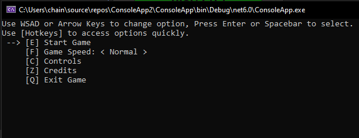
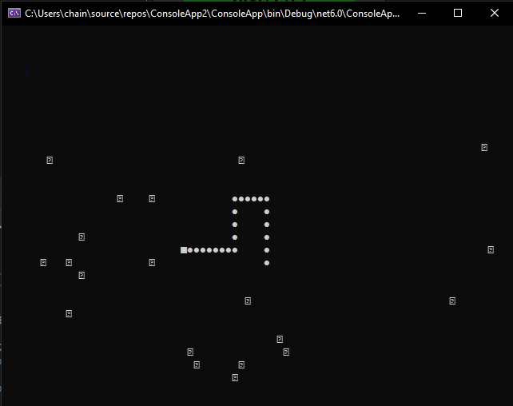
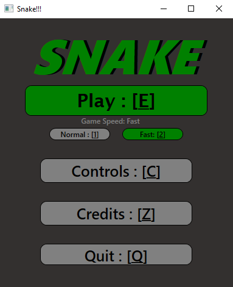
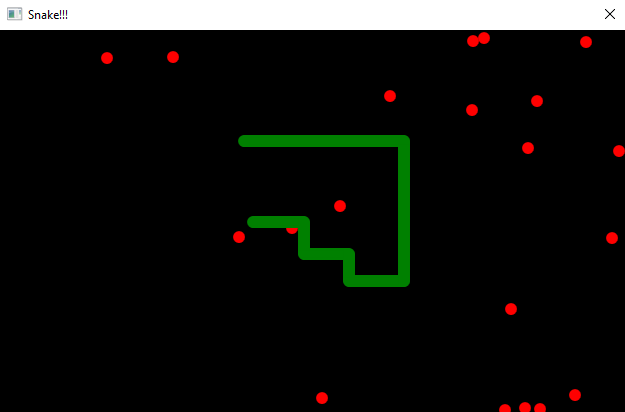

### Introduction
This project centers around building a functioning video game interface utilizing multiple methods.
As an additional feature it contains two renditions of the classic game "Snake", created to be in alignment with the interface's visual direction.
Both implementations use the same game logic, differing in the way it is rendered. 
### Console
This side of the application is exceedingly simple,
it contains a text-based UI with horizontal and vertical selection,

and an ascii rendition of Snake,

### WPF
A more mainstream approach to this project using Windows Presentation Foundation (WPF) to draw the UI and game visuals.
The application consists of two windows, 
the menu window,

and also the game view,

### Game Details
The game is as easy to understand as it is well-known, 
it's goal is to accumulate length by moving around the "map" area,
accomplished by consuming surrounding objects, while avoiding the game-over scenario,
which occurs when the "head" of the player's avatar meets any other point along it's body.
